# Technical Design: Chat Engine

## 1. Architecture Overview

### 1.1 Architectural Vision

Chat Engine is designed as a **stateful proxy service** that decouples conversational infrastructure from message processing logic. The system follows a **hub-and-spoke architecture** where Chat Engine acts as the central hub managing session state, message history, and routing, while external webhook backends serve as spokes implementing custom message processing logic.

The architecture emphasizes **separation of concerns**: Chat Engine handles persistence, routing, and message tree management, while webhook backends focus solely on message processing. This enables flexible experimentation with different AI models, processing strategies, and conversation patterns without requiring changes to client applications or infrastructure.

**Key architectural decisions:**
- **Message Tree Structure**: Messages form an immutable tree structure enabling conversation branching and variant preservation
- **Streaming-First**: All responses stream from webhook backends through Chat Engine to clients with minimal latency overhead
- **Webhook-Driven Capabilities**: Session capabilities are dynamically determined by webhook backends, not hardcoded in Chat Engine
- **Stateless Routing**: Chat Engine instances can scale horizontally as all session state is persisted in the database

The system supports both **linear conversations** (traditional chat) and **non-linear conversations** (branching, variants, regeneration), enabling advanced use cases like conversation exploration, A/B testing of different backends, and human-in-the-loop workflows.

### 1.2 Architecture Drivers

#### Functional Requirements

| FDD ID | Solution Description |
|--------|----------------------|
| `cpt-chat-engine-fr-create-session` | RESTful API endpoint creates session record, invokes webhook backend with `session.created` event, stores returned capabilities |
| `cpt-chat-engine-fr-send-message` | HTTP streaming endpoint forwards message to webhook backend, pipes streamed response back to client, persists complete exchange after streaming |
| `cpt-chat-engine-fr-attach-files` | Messages support file URL array field; client uploads to external storage first, includes URLs in message payload |
| `cpt-chat-engine-fr-switch-session-type` | Session stores current session_type_id; switching updates this field and routes next message to new webhook backend |
| `cpt-chat-engine-fr-recreate-response` | Creates new message with same parent_message_id as original, sends `message.recreate` event to webhook backend |
| `cpt-chat-engine-fr-branch-message` | Client specifies parent_message_id; Chat Engine loads context up to parent, creates new branch in message tree |
| `cpt-chat-engine-fr-navigate-variants` | Query API returns all messages with same parent_message_id; includes variant position metadata (e.g., "2 of 3") |
| `cpt-chat-engine-fr-stop-streaming` | Client closes HTTP connection; Chat Engine cancels webhook request, saves partial response with incomplete flag |
| `cpt-chat-engine-fr-export-session` | Background job traverses message tree (active path or all variants), formats to JSON/Markdown/TXT, uploads to storage |
| `cpt-chat-engine-fr-share-session` | Generates unique share token stored in database, maps to session_id; recipients create branches from last message |
| `cpt-chat-engine-fr-session-summary` | Routes `session.summary` event to dedicated summarization service URL or webhook backend based on session type config |
| `cpt-chat-engine-fr-search-session` | Full-text search on messages table filtered by session_id; returns matches with context window |
| `cpt-chat-engine-fr-search-sessions` | Full-text search across messages joined with sessions; ranks by relevance, returns session metadata |
| `cpt-chat-engine-fr-delete-session` | Sends `session.deleted` event to webhook backend, then soft-deletes session and messages in database |
| `cpt-chat-engine-fr-conversation-memory` | Message history forwarded to webhook with configurable depth; visibility flags (`is_hidden_from_llm`) enable token management strategies |
| `cpt-chat-engine-fr-delete-message` | Hard delete individual messages with cascade reaction cleanup; ownership validation before deletion |
| `cpt-chat-engine-fr-message-feedback` | UPSERT reaction per user per message; fire-and-forget webhook notification via `message.reaction` event |
| `cpt-chat-engine-fr-context-overflow` | Session metadata exposes token usage; visibility flags and summary primitives enable overflow strategy implementation |
| `cpt-chat-engine-fr-message-retention` | Background cleanup job enforces per-session-type retention policies; tree-aware deletion preserves active path integrity |

#### Non-functional Requirements

| FDD ID | Solution Description |
|--------|----------------------|
| `cpt-chat-engine-nfr-response-time` | Async I/O event-driven architecture; database connection pooling; minimal business logic in routing layer |
| `cpt-chat-engine-nfr-availability` | Stateless instances behind load balancer; health check endpoints; database read replicas for failover |
| `cpt-chat-engine-nfr-scalability` | Horizontal scaling; database sharding by client_id; connection pool per instance |
| `cpt-chat-engine-nfr-data-persistence` | Database transactions wrap message writes; acknowledge client only after commit confirmation |
| `cpt-chat-engine-nfr-streaming` | HTTP chunked transfer encoding; buffering disabled; direct pipe from webhook to client |
| `cpt-chat-engine-nfr-authentication` | JWT-based authentication; client_id claim extraction; session ownership validation on every request |
| `cpt-chat-engine-nfr-data-integrity` | Database foreign key constraints on parent_message_id; unique constraint on (session_id, parent_message_id, variant_index) |
| `cpt-chat-engine-nfr-backend-isolation` | Circuit breaker pattern per webhook backend; timeout configuration per session type; error isolation |
| `cpt-chat-engine-nfr-file-size` | File size validation delegated to storage service; Chat Engine validates URL format and accessibility |
| `cpt-chat-engine-nfr-search` | Full-text search indexes on message content; pagination with cursor-based queries |

### 1.3 Architecture Layers

| Layer | Responsibility | Technology |
|-------|---------------|------------|
| **API Layer** | HTTP request handling, streaming response coordination, authentication, chunked transfer encoding | HTTP server with async I/O |
| **Application Layer** | Use case orchestration, webhook invocation, streaming coordination | Service classes with dependency injection |
| **Domain Layer** | Business logic, message tree operations, validation rules | Domain entities and value objects |
| **Infrastructure Layer** | Database access, HTTP client for webhooks, file storage client | PostgreSQL, HTTP client library, S3 SDK |

## 2. Principles & Constraints

### 2.1 Design Principles

#### Principle: Immutable Message Tree

**ID**: `cpt-chat-engine-principle-immutable-tree`

<!-- fdd-id-content -->
**ADRs**: ADR-0001

Once a message is created with a parent_message_id, that relationship is immutable. Messages are never moved or re-parented. This ensures referential integrity and enables safe concurrent message creation. Variants are created as siblings (same parent), not by modifying existing messages.
<!-- fdd-id-content -->

#### Principle: Webhook Backend Authority

**ID**: `cpt-chat-engine-principle-webhook-authority`

<!-- fdd-id-content -->
**ADRs**: ADR-0002

Webhook backends are authoritative for session capabilities and message processing logic. Chat Engine does not interpret or validate capability semantics—it only stores and forwards them. This allows backends to evolve independently without Chat Engine changes.
<!-- fdd-id-content -->

#### Principle: Stream Everything

**ID**: `cpt-chat-engine-principle-streaming`

<!-- fdd-id-content -->
**ADRs**: ADR-0003

All webhook responses are streamed by default to minimize time-to-first-byte. Even non-streaming backends are wrapped in streaming adapters. Chat Engine buffers minimally and pipes data directly from webhook to client over persistent connections with bidirectional message framing.
<!-- fdd-id-content -->

#### Principle: Zero Business Logic in Routing

**ID**: `cpt-chat-engine-principle-zero-business-logic`

<!-- fdd-id-content -->
**ADRs**: ADR-0004

Chat Engine does not process, analyze, or transform message content. All business logic (content moderation, language detection, sentiment analysis) belongs in webhook backends. Chat Engine only routes, persists, and manages message trees.
<!-- fdd-id-content -->

### 2.2 Constraints

#### Constraint: External File Storage

**ID**: `cpt-chat-engine-constraint-external-storage`

<!-- fdd-id-content -->
**ADRs**: ADR-0005

Chat Engine does not store file content. Clients must upload files to File Storage Service and include file UUIDs (stable identifiers) in messages. File Storage Service provides separate API for accessing files by UUID. This constraint reduces infrastructure complexity and storage costs while enabling centralized access control.
<!-- fdd-id-content -->

#### Constraint: Synchronous Webhook Invocation

**ID**: `cpt-chat-engine-constraint-sync-webhooks`

<!-- fdd-id-content -->
**ADRs**: ADR-0006

Webhook backends must respond synchronously (with streaming) over HTTP. Asynchronous/callback-based backends are not supported. This constraint simplifies error handling and keeps client connections open for streaming. Note: The client-to-Chat Engine protocol is independent of the webhook protocol, which remains HTTP-based.
<!-- fdd-id-content -->

#### Constraint: Single Database Instance

**ID**: `cpt-chat-engine-constraint-single-database`

<!-- fdd-id-content -->
**ADRs**: ADR-0007

All Chat Engine instances share a single database cluster. No local caching of session state or messages. This ensures consistency but limits scalability to database write throughput.
<!-- fdd-id-content -->

## 3. Technical Architecture

### 3.1 Domain Model

**Technology**: GTS (JSON Schema)

**Location**: `schemas/`

**Core Schemas**:

#### Session Operations (session/)

- **SessionCreateRequest** - Create session (session_type_id, client_id)
- **SessionCreateResponse** - Session created (session_id, available_capabilities)
- **SessionGetRequest** - Get session (session_id)
- **SessionGetResponse** - Session details (session_id, client_id, session_type_id, available_capabilities, metadata, created_at)
- **SessionDeleteRequest** - Delete session (session_id)
- **SessionDeleteResponse** - Deletion confirmed (deleted)
- **SessionSwitchTypeRequest** - Switch type (session_id, new_session_type_id)
- **SessionSwitchTypeResponse** - Type switched (session_id, session_type_id)
- **SessionExportRequest** - Export session (session_id, format, scope)
- **SessionExportResponse** - Export ready (download_url, expires_at)
- **SessionShareRequest** - Generate share link (session_id)
- **SessionShareResponse** - Share link (share_token, share_url)
- **SessionAccessSharedRequest** - Access shared (share_token)
- **SessionAccessSharedResponse** - Shared session (session_id, messages, read_only)
- **SessionSearchRequest** - Search in session (session_id, query, limit, offset)
- **SessionSearchResponse** - Search results (results)
- **SessionsSearchRequest** - Search across sessions (query, limit, offset)
- **SessionsSearchResponse** - Sessions found (results)
- **SessionSummarizeRequest** - Generate summary (session_id, enabled_capabilities)

#### Message Operations (message/)

- **MessageSendRequest** - Send message (session_id, content, file_ids, parent_message_id, enabled_capabilities)
- **MessageListRequest** - List messages (session_id, parent_message_id)
- **MessageListResponse** - Messages list (messages)
- **MessageGetRequest** - Get message (message_id)
- **MessageGetResponse** - Message details (message_id, role, content, file_ids, metadata, variant_info)
- **MessageRecreateRequest** - Recreate response (message_id, enabled_capabilities)
- **MessageGetVariantsRequest** - Get variants (message_id)
- **MessageGetVariantsResponse** - Variants list (variants, current_index)

#### Streaming Events (streaming/)

**Note**: Sent via HTTP chunked response as newline-delimited JSON (NDJSON)

- **StreamingStartEvent** - Begin streaming (message_id)
- **StreamingChunkEvent** - Stream chunk (message_id, chunk)
- **StreamingCompleteEvent** - Streaming finished (message_id, metadata)
- **StreamingErrorEvent** - Stream error (message_id, error_code, message)

#### Webhook Protocol (webhook/)

- **SessionCreatedEvent** - Session created notification (event, session_id, session_type_id, client_id, timestamp)
- **SessionCreatedResponse** - Capabilities list (available_capabilities)
- **MessageNewEvent** - New message for processing (event, session_id, message_id, session_metadata, enabled_capabilities, message, history, timestamp)
- **MessageNewResponse** - Assistant response (message_id, role, content, metadata)
- **MessageRecreateEvent** - Recreate request (event, session_id, message_id, enabled_capabilities, history, timestamp)
- **MessageRecreateResponse** - Recreated response (same as MessageNewResponse)
- **MessageAbortedEvent** - Streaming cancelled (event, session_id, message_id, partial_content, timestamp)
- **SessionDeletedEvent** - Session deleted (event, session_id, timestamp)
- **SessionSummaryEvent** - Summary request (event, session_id, enabled_capabilities, history, summarization_settings, timestamp)
- **SessionSummaryResponse** - Summary text (summary, metadata)
- **SessionTypeHealthCheckEvent** - Health check (event, session_type_id, timestamp)
- **SessionTypeHealthCheckResponse** - Health status (status, version, capabilities)

#### Common Types (common/)

- **Session** - Session entity (session_id, client_id, session_type_id, available_capabilities, metadata, created_at, updated_at, share_token)
- **Message** - Message entity (message_id, session_id, parent_message_id, role, content, file_ids, variant_index, is_active, is_complete, metadata, created_at)
- **SessionType** - Session type config (session_type_id, name, webhook_url, timeout, summarization_settings, meta, created_at, updated_at)
- **Capability** - Capability definition (name, config, metadata)
- **ContentPart** - Abstract content type (type, ...)
- **TextContent** - Plain text content (type: "text", text)
- **CodeContent** - Code block (type: "code", language, code)
- **ImageContent** - Image content (type: "image", image_id: uuid, mime_type)
- **AudioContent** - Audio content (type: "audio", audio_id: uuid, mime_type)
- **VideoContent** - Video content (type: "video", video_id: uuid, mime_type)
- **DocumentContent** - Document content (type: "document", document_id: uuid, mime_type)
- **Usage** - Token usage (input_tokens, output_tokens)
- **VariantInfo** - Variant metadata (variant_index, total_variants, is_active)
- **SearchResult** - Search match (message_id, content, context)
- **SessionSearchResult** - Session match (session_id, metadata, matched_messages)
- **Role** - Enum: user, assistant, system
- **ErrorCode** - Enum: AUTH_REQUIRED, SESSION_NOT_FOUND, MESSAGE_NOT_FOUND, INVALID_REQUEST, BACKEND_TIMEOUT, BACKEND_ERROR, RATE_LIMIT_EXCEEDED, INTERNAL_ERROR
- **ErrorDetails** - Safe error details (trace_id, validation_errors, retry_after_seconds, limit_type, quota_reset_at, timeout_ms, resource_id)
- **ExportFormat** - Enum: json, markdown, txt
- **ExportScope** - Enum: active, all
- **SummarizationSettings** - Summary config (enabled, service_url, config)
- **ReactionType** - Enum: like, dislike, none
- **MessageReaction** - Reaction record (message_id, user_id, reaction_type, created_at, updated_at)
- **MessageReactionRequest** - HTTP request (reaction_type: ReactionType)
- **MessageReactionResponse** - HTTP response (message_id, reaction_type, applied: boolean)
- **MessageReactionEvent** - Webhook event (event, session_id, message_id, user_id, reaction_type, previous_reaction_type, timestamp)

**Relationships**:

HTTP Protocol:
- StreamingStartEvent, StreamingChunkEvent, StreamingCompleteEvent, StreamingErrorEvent → message_id: linked sequence
- SessionCreateRequest → SessionType: references via session_type_id
- MessageSendRequest → Session: references via session_id
- MessageSendRequest → Message: optional parent via parent_message_id
- MessageSendRequest → Capability: references via enabled_capabilities
- MessageGetResponse → VariantInfo: includes variant metadata
- SessionSearchResponse, SessionsSearchResponse → SearchResult/SessionSearchResult: contains results

Webhook Protocol:
- SessionCreatedEvent → Session: creates
- SessionCreatedResponse → Capability: returns list
- MessageNewEvent, MessageRecreateEvent → Message: references
- MessageNewEvent, MessageRecreateEvent → Session: context
- MessageNewEvent, SessionSummaryEvent → Capability: filters via enabled_capabilities
- MessageNewResponse, MessageRecreateResponse → ContentPart: contains array
- MessageNewResponse, MessageRecreateResponse → Usage: includes metadata
- SessionSummaryEvent → SummarizationSettings: includes config

Common Types:
- Session → SessionType: references via session_type_id
- Session → Capability: contains available_capabilities array
- Message → Session: belongs to via session_id
- Message → Message: tree structure via parent_message_id
- Message → Role: has role enum
- Message → ContentPart: contains content array
- Message → Usage: optional in metadata
- SessionType → SummarizationSettings: optional config
- ContentPart ← TextContent, CodeContent, ImageContent, AudioContent, VideoContent, DocumentContent: polymorphic
- MessageReaction → Message: references via message_id
- MessageReaction → ReactionType: uses type enum
- MessageReactionEvent → MessageReaction: notifies on change

### 3.2 Architecture Overview

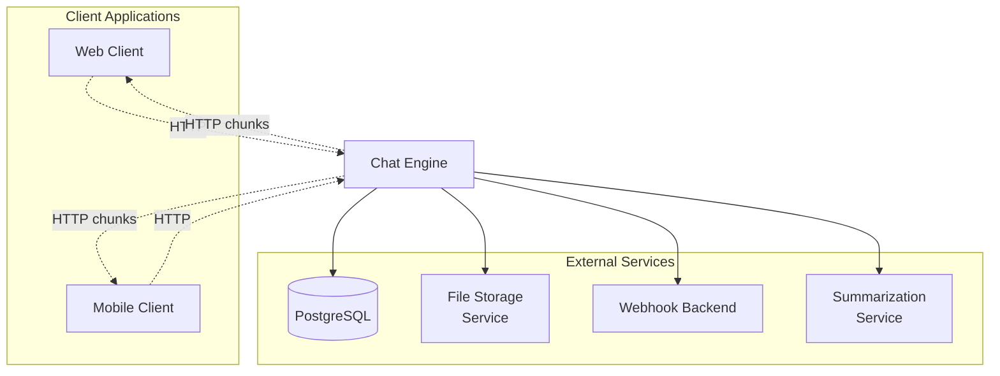
```mermaid
flowchart TB
    subgraph Client Applications
        WebClient[Web Client]
        MobileClient[Mobile Client]
    end

    ChatEngine[Chat Engine]

    subgraph External Services
        DB[(PostgreSQL)]
        Storage[File Storage<br/>Service]
        Webhook[Webhook Backend]
        Summ[Summarization<br/>Service]
    end

    WebClient -.HTTP.-> ChatEngine
    MobileClient -.HTTP.-> ChatEngine

    ChatEngine --> DB
    ChatEngine --> Webhook
    ChatEngine --> Storage
    ChatEngine --> Summ

    ChatEngine -.HTTP chunks.-> WebClient
    ChatEngine -.HTTP chunks.-> MobileClient
```

**System Architecture**:

Chat Engine handles all chat-related operations. It is deployed as a unified monolithic service, not as separate microservices. Each instance includes an HTTP server with chunked streaming support for client connections and provides the following core functionality through internal modules.

**Core Functionality**:

#### Session Management

<!-- fdd-id-content -->
Chat Engine manages session lifecycle operations including create, delete, and retrieve. It invokes the webhook backend with `session.created` event and stores returned capabilities. This functionality handles session type switching and share token generation.
<!-- fdd-id-content -->

#### Message Processing

<!-- fdd-id-content -->
**ADRs**: ADR-0001 (tree management), ADR-0014 (variant assignment), ADR-0016 (recreation logic)

Chat Engine orchestrates message creation, persistence, and tree management. It validates parent references, assigns variant_index, and enforces tree constraints. Message processing integrates with webhook invocation functionality for backend communication.
<!-- fdd-id-content -->

#### Webhook Integration

<!-- fdd-id-content -->
**ADRs**: ADR-0004 (zero business logic), ADR-0006 (HTTP protocol), ADR-0011 (circuit breaker), ADR-0013 (timeout)

Chat Engine's HTTP client functionality for webhook backend invocation. It constructs event payloads, handles timeouts, and implements circuit breaker pattern.
<!-- fdd-id-content -->

#### Response Streaming

<!-- fdd-id-content -->
**ADRs**: ADR-0003 (streaming architecture), ADR-0009 (cancellation), ADR-0012 (backpressure)

Chat Engine manages HTTP chunked streaming functionality. It pipes data from webhook backend to client via HTTP streaming responses. This handles stateless request processing, partial response saving on connection close, and backpressure control. Each stream is identified by unique message_id.
<!-- fdd-id-content -->

#### Conversation Export

<!-- fdd-id-content -->
Chat Engine provides conversation export functionality that traverses the message tree, formats content to JSON/Markdown/TXT, and uploads to file storage. Supports active path filtering and full tree export.
<!-- fdd-id-content -->

#### Message Search

<!-- fdd-id-content -->
**ADRs**: ADR-0023 (search strategy)

Chat Engine provides full-text search capabilities across messages. It implements session-scoped and cross-session search with ranking, pagination, and context window retrieval.
<!-- fdd-id-content -->

#### Message Reactions

<!-- fdd-id-content -->
**ADRs**: ADR-0024 (message reactions design)

Chat Engine allows users to react to messages with simple like/dislike feedback. Reactions are stored per-user per-message with UPSERT semantics, and backend systems are notified via fire-and-forget webhook events.

**Key Features**:
- One reaction per user per message (can be changed or removed)
- UPSERT semantics: changing reaction overwrites previous
- HTTP API: `POST /messages/{id}/reaction` with `{reaction_type: "like"|"dislike"|"none"}`
- Webhook notification: `message.reaction` event sent to backend after storage
- Fire-and-forget pattern: webhook failures don't affect client response
- Database: Composite primary key (message_id, user_id) ensures uniqueness
- Cascade delete: reactions removed when message is deleted
<!-- fdd-id-content -->

**Key Interactions**:
- Client → Chat Engine: Session and message operations via HTTP REST API
- Chat Engine → Webhook Backend: HTTP POST with event payload and session context
- Chat Engine → Client: HTTP chunked streaming with NDJSON messages
- Chat Engine → File Storage: File upload with signed URL generation for exports
- Chat Engine → Database: All persistence operations for sessions, messages, and metadata
- Chat Engine → Summarization Service: Context summarization requests

### Component Model

Chat Engine is deployed as a unified monolithic service. All functionality is implemented as internal modules within the same deployment unit. See Section 3.2 Architecture Overview for detailed module descriptions.

#### Chat Engine Service

**ID**: `cpt-chat-engine-component-service`

**Responsibility scope**: Persistence, routing, and message tree management. Chat Engine does not interpret message content.

**Responsibility boundaries**: Content moderation, AI processing, and summarization logic belong to webhook backends. File content storage belongs to File Storage Service. See `cpt-chat-engine-principle-zero-business-logic`.

**Related components (by ID)**:
- `cpt-chat-engine-actor-webhook-backend` — processes messages; called by Webhook Integration module
- `cpt-chat-engine-actor-file-storage` — stores file content; called by Conversation Export module
- `cpt-chat-engine-actor-database` — persists all session and message state

#### Session Management Module

**ID**: `cpt-chat-engine-component-session-management`

Session lifecycle operations: create, delete, retrieve, type switching, share token generation. Invokes webhook with `session.created` event.

#### Message Processing Module

**ID**: `cpt-chat-engine-component-message-processing`

Message tree management: creation, persistence, parent validation, variant_index assignment, tree constraints. **ADRs**: ADR-0001, ADR-0014, ADR-0016.

#### Webhook Integration Module

**ID**: `cpt-chat-engine-component-webhook-integration`

HTTP client for webhook invocation: event payload construction, timeout handling, circuit breaker pattern. **ADRs**: ADR-0004, ADR-0006, ADR-0011, ADR-0013.

#### Response Streaming Module

**ID**: `cpt-chat-engine-component-response-streaming`

HTTP chunked streaming: webhook-to-client pipe, backpressure control, connection cancellation, partial response saving. **ADRs**: ADR-0003, ADR-0009, ADR-0012.

#### Conversation Export Module

**ID**: `cpt-chat-engine-component-conversation-export`

Message tree traversal, format rendering (JSON/Markdown/TXT), file storage upload. Supports active path and full tree export.

#### Message Search Module

**ID**: `cpt-chat-engine-component-message-search`

Full-text search across messages: session-scoped and cross-session search, ranking, pagination, context window retrieval. **ADRs**: ADR-0023.

#### Message Reactions Module

**ID**: `cpt-chat-engine-component-message-reactions`

Per-user per-message reactions with UPSERT semantics. Fire-and-forget webhook notification. Cascade delete on message removal. **ADRs**: ADR-0024.

### 3.3 API Contracts

See [`api/README.md`](api/README.md) for comprehensive protocol documentation.

#### 3.3.1 HTTP REST API (Client ↔ Chat Engine)

**Specification**: [`api/http-protocol.json`](api/http-protocol.json) (OpenAPI 3.0.3)

**Base URL**: `https://chat-engine/api/v1`

**Authentication**: JWT Bearer token in Authorization header

**15 REST endpoints** across 3 categories:
- **Session Management (10)**: Create, get, delete, switch type, export, share, access shared, search, summarize (streaming)
- **Message Operations (5)**: Send (streaming), recreate (streaming), list, get, variants, reaction

**HTTP Streaming**:
- Content-Type: `application/x-ndjson` (newline-delimited JSON)
- Transfer-Encoding: chunked
- Cancellation: Close HTTP connection
- Events: start, chunk, complete, error

For complete endpoint definitions, request/response schemas, and examples, see the OpenAPI specification file.

#### 3.3.2 Webhook API (Chat Engine ↔ Webhook Backend)

**Specification**: [`api/webhook-protocol.json`](api/webhook-protocol.json) (GTS JSON Schema)

**Method**: HTTP POST

**Content-Type**: `application/json`

**Accept**: `application/json`, `application/x-ndjson`

**8 Webhook operations**:
- `session.created` - Session creation notification
- `message.new` - New user message processing
- `message.recreate` - Message regeneration request
- `message.aborted` - Streaming cancellation notification
- `session.deleted` - Session deletion notification
- `session.summary` - Session summarization request
- `session_type.health_check` - Backend health check
- `message.reaction` - Message reaction notification

**Streaming Format**: Newline-delimited JSON (NDJSON) over HTTP chunked transfer

For complete webhook schemas, NDJSON streaming format, and resilience patterns, see the Webhook protocol specification file.

### Internal Dependencies

Chat Engine is a standalone service with no internal module dependencies within the platform. All inter-system communication is to external services (see External Dependencies below).

| Dependency Module | Interface Used | Purpose |
|-------------------|----------------|---------|
| — | — | No internal platform module dependencies |

### External Dependencies

| Dependency | Interface | Purpose |
|------------|-----------|---------|
| PostgreSQL | SQL over TLS | Primary persistence for sessions, messages, session types, reactions |
| Webhook Backend | HTTP POST (`webhook-protocol.json`) | Message processing, session events, summarization |
| File Storage Service | HTTP REST | File upload for exports; file access via UUID |
| Summarization Service | HTTP POST (`webhook-protocol.json`) | Optional dedicated session summarization |

### 3.4 Interactions & Sequences

#### S1: Configure Session Type

**ID**: `cpt-chat-engine-seq-configure-session-type`
**Use Case**: Admin configures new session type
**Actors**: `cpt-chat-engine-actor-developer`
**PRD Reference**: Backend configuration (implicit in `cpt-chat-engine-fr-create-session`)

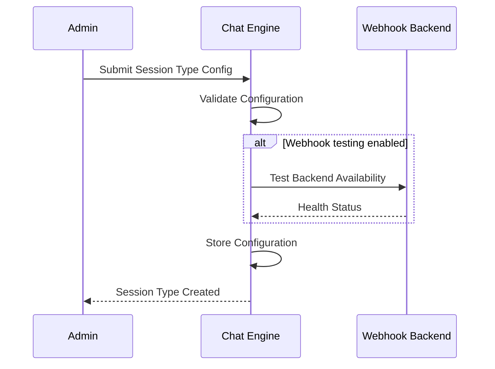
```mermaid
sequenceDiagram
    participant Admin
    participant Chat Engine
    participant Webhook Backend

    Admin->>Chat Engine: Submit Session Type Config
    Chat Engine->>Chat Engine: Validate Configuration

    alt Webhook testing enabled
        Chat Engine->>Webhook Backend: Test Backend Availability
        Webhook Backend-->>Chat Engine: Health Status
    end

    Chat Engine->>Chat Engine: Store Configuration

    Chat Engine-->>Admin: Session Type Created
```

#### S2: Create Session and Send First Message

**ID**: `cpt-chat-engine-seq-create-session`
**Use Case**: `cpt-chat-engine-usecase-create-session`
**Actors**: `cpt-chat-engine-actor-client`, `cpt-chat-engine-actor-webhook-backend`

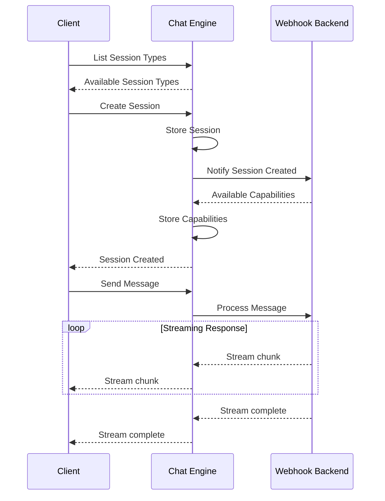
```mermaid
sequenceDiagram
    participant Client
    participant Chat Engine
    participant Webhook Backend

    Client->>Chat Engine: List Session Types
    Chat Engine-->>Client: Available Session Types

    Client->>Chat Engine: Create Session

    Chat Engine->>Chat Engine: Store Session
    Chat Engine->>Webhook Backend: Notify Session Created
    Webhook Backend-->>Chat Engine: Available Capabilities

    Chat Engine->>Chat Engine: Store Capabilities
    Chat Engine-->>Client: Session Created

    Client->>Chat Engine: Send Message

    Chat Engine->>Webhook Backend: Process Message

    loop Streaming Response
        Webhook Backend-->>Chat Engine: Stream chunk
        Chat Engine-->>Client: Stream chunk
    end

    Webhook Backend-->>Chat Engine: Stream complete
    Chat Engine-->>Client: Stream complete
```

#### S3: Send Message with File Attachments

**ID**: `cpt-chat-engine-seq-send-message-with-files`
**Use Case**: `cpt-chat-engine-fr-attach-files`
**Actors**: `cpt-chat-engine-actor-client`, `cpt-chat-engine-actor-file-storage`

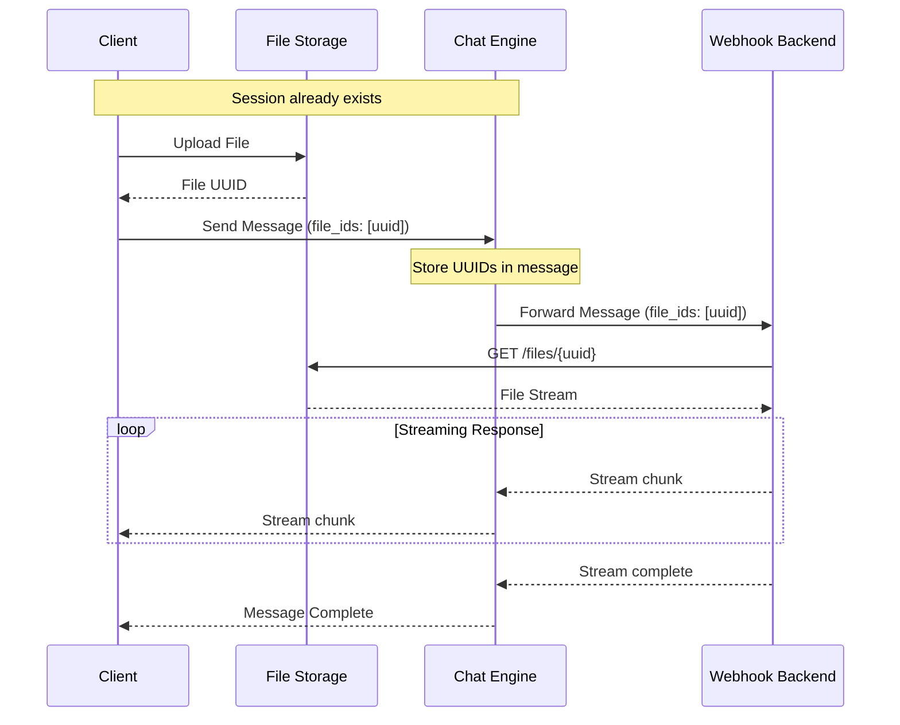
```mermaid
sequenceDiagram
    participant Client
    participant File Storage
    participant Chat Engine
    participant Webhook Backend

    Note over Client,Chat Engine: Session already exists

    Client->>File Storage: Upload File
    File Storage-->>Client: File UUID

    Client->>Chat Engine: Send Message (file_ids: [uuid])
    Note over Chat Engine: Store UUIDs in message
    Chat Engine->>Webhook Backend: Forward Message (file_ids: [uuid])

    Webhook Backend->>File Storage: GET /files/{uuid}
    File Storage-->>Webhook Backend: File Stream

    loop Streaming Response
        Webhook Backend-->>Chat Engine: Stream chunk
        Chat Engine-->>Client: Stream chunk
    end

    Webhook Backend-->>Chat Engine: Stream complete
    Chat Engine-->>Client: Message Complete
```

#### S4: Switch Session Type Mid-Conversation

**ID**: `cpt-chat-engine-seq-switch-session-type`
**Use Case**: `cpt-chat-engine-fr-switch-session-type`
**Actors**: `cpt-chat-engine-actor-client`, `cpt-chat-engine-actor-webhook-backend`

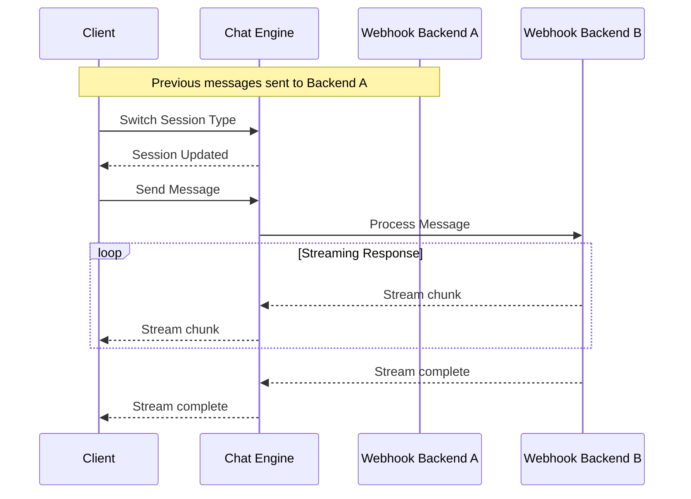
```mermaid
sequenceDiagram
    participant Client
    participant Chat Engine
    participant Webhook Backend A
    participant Webhook Backend B

    Note over Client,Webhook Backend A: Previous messages sent to Backend A

    Client->>Chat Engine: Switch Session Type
    Chat Engine-->>Client: Session Updated

    Client->>Chat Engine: Send Message
    Chat Engine->>Webhook Backend B: Process Message

    loop Streaming Response
        Webhook Backend B-->>Chat Engine: Stream chunk
        Chat Engine-->>Client: Stream chunk
    end

    Webhook Backend B-->>Chat Engine: Stream complete
    Chat Engine-->>Client: Stream complete
```

#### S5: Recreate Assistant Response (Variant Creation)

**ID**: `cpt-chat-engine-seq-recreate-response`
**Use Case**: `cpt-chat-engine-usecase-recreate-response`
**Actors**: `cpt-chat-engine-actor-client`, `cpt-chat-engine-actor-webhook-backend`

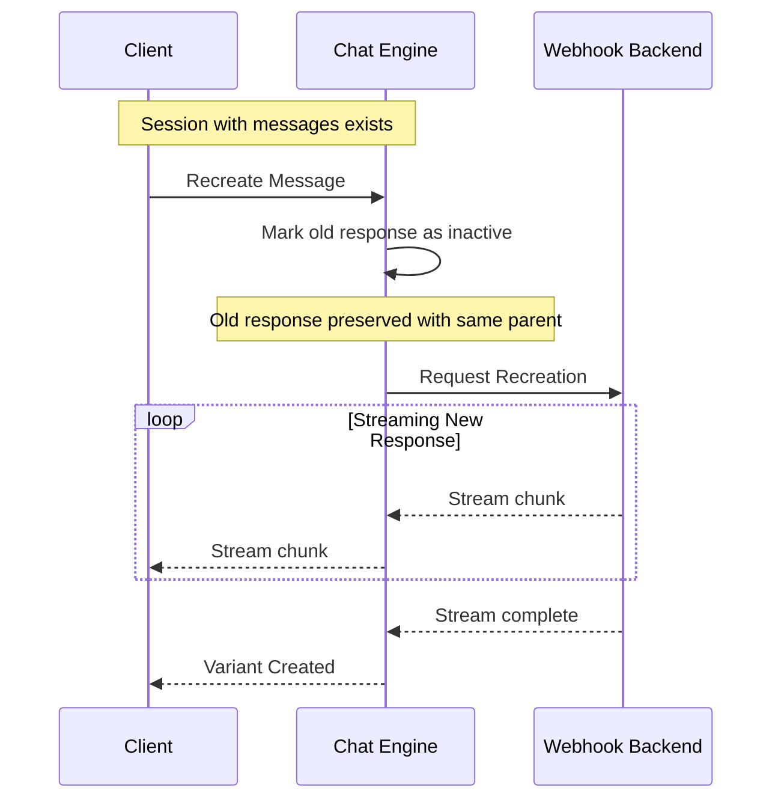
```mermaid
sequenceDiagram
    participant Client
    participant Chat Engine
    participant Webhook Backend

    Note over Client,Chat Engine: Session with messages exists

    Client->>Chat Engine: Recreate Message
    Chat Engine->>Chat Engine: Mark old response as inactive
    Note over Chat Engine: Old response preserved with same parent
    Chat Engine->>Webhook Backend: Request Recreation

    loop Streaming New Response
        Webhook Backend-->>Chat Engine: Stream chunk
        Chat Engine-->>Client: Stream chunk
    end

    Webhook Backend-->>Chat Engine: Stream complete
    Chat Engine-->>Client: Variant Created
```

#### S6: Branch from Historical Message

**ID**: `cpt-chat-engine-seq-branch-message`
**Use Case**: `cpt-chat-engine-usecase-branch-message`
**Actors**: `cpt-chat-engine-actor-client`, `cpt-chat-engine-actor-webhook-backend`

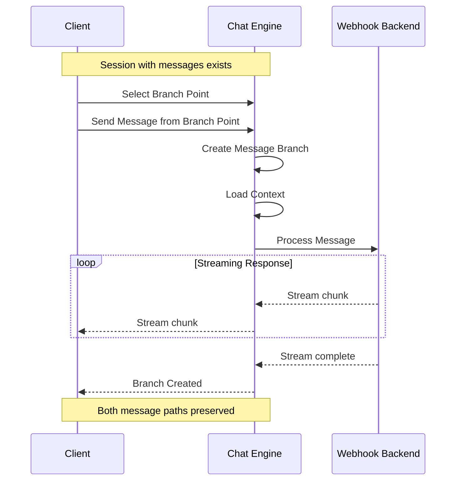
```mermaid
sequenceDiagram
    participant Client
    participant Chat Engine
    participant Webhook Backend

    Note over Client,Chat Engine: Session with messages exists

    Client->>Chat Engine: Select Branch Point
    Client->>Chat Engine: Send Message from Branch Point

    Chat Engine->>Chat Engine: Create Message Branch
    Chat Engine->>Chat Engine: Load Context
    Chat Engine->>Webhook Backend: Process Message

    loop Streaming Response
        Webhook Backend-->>Chat Engine: Stream chunk
        Chat Engine-->>Client: Stream chunk
    end

    Webhook Backend-->>Chat Engine: Stream complete
    Chat Engine-->>Client: Branch Created

    Note over Client,Chat Engine: Both message paths preserved
```

#### S7: Navigate Message Variants

**ID**: `cpt-chat-engine-seq-navigate-variants`
**Use Case**: `cpt-chat-engine-fr-navigate-variants`
**Actors**: `cpt-chat-engine-actor-client`

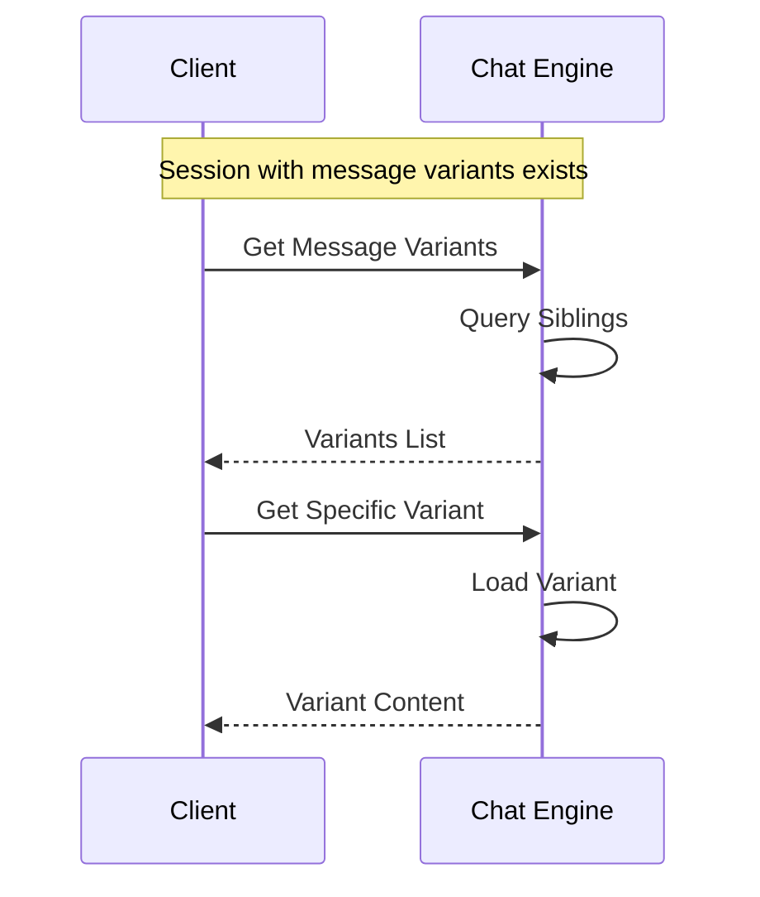
```mermaid
sequenceDiagram
    participant Client
    participant Chat Engine

    Note over Client,Chat Engine: Session with message variants exists

    Client->>Chat Engine: Get Message Variants
    Chat Engine->>Chat Engine: Query Siblings
    Chat Engine-->>Client: Variants List

    Client->>Chat Engine: Get Specific Variant
    Chat Engine->>Chat Engine: Load Variant
    Chat Engine-->>Client: Variant Content
```

#### S8: Export Session

**ID**: `cpt-chat-engine-seq-export-session`
**Use Case**: `cpt-chat-engine-usecase-export-session`
**Actors**: `cpt-chat-engine-actor-client`

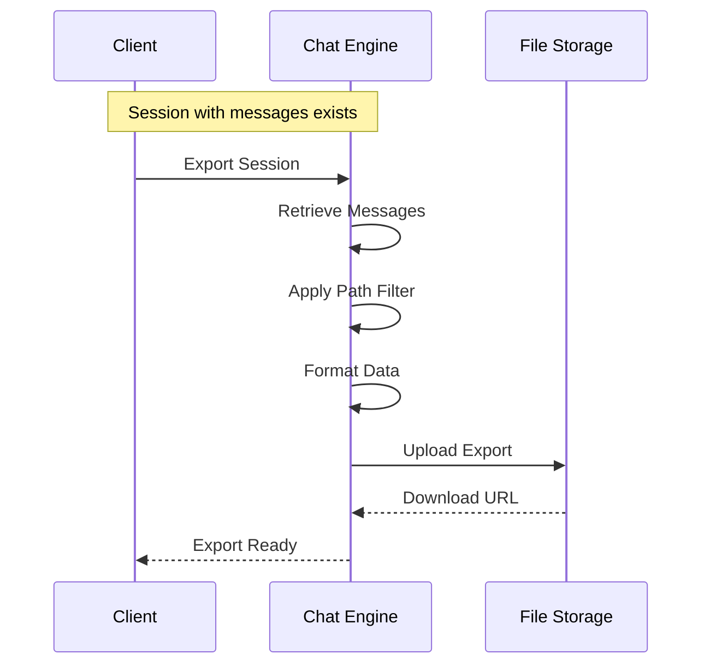
```mermaid
sequenceDiagram
    participant Client
    participant Chat Engine
    participant File Storage

    Note over Client,Chat Engine: Session with messages exists

    Client->>Chat Engine: Export Session
    Chat Engine->>Chat Engine: Retrieve Messages
    Chat Engine->>Chat Engine: Apply Path Filter
    Chat Engine->>Chat Engine: Format Data
    Chat Engine->>File Storage: Upload Export
    File Storage-->>Chat Engine: Download URL
    Chat Engine-->>Client: Export Ready
```

#### S9: Share Session

**ID**: `cpt-chat-engine-seq-share-session`
**Use Case**: `cpt-chat-engine-usecase-share-session`
**Actors**: `cpt-chat-engine-actor-end-user`, `cpt-chat-engine-actor-webhook-backend`

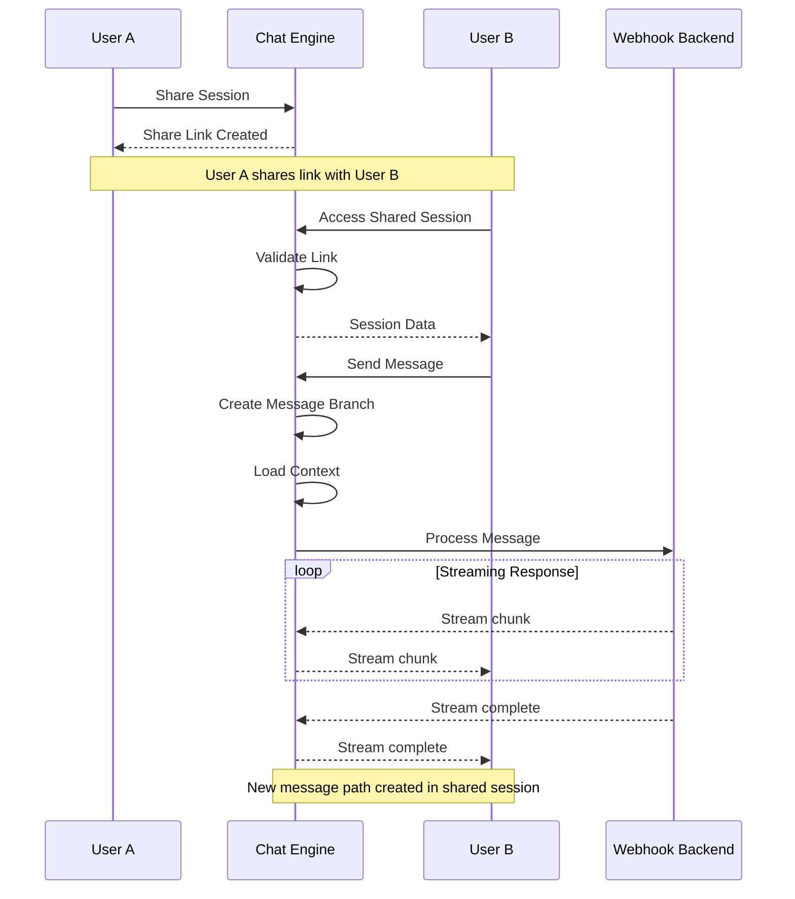
```mermaid
sequenceDiagram
    participant User A
    participant Chat Engine
    participant User B
    participant Webhook Backend

    User A->>Chat Engine: Share Session
    Chat Engine-->>User A: Share Link Created

    Note over User A,User B: User A shares link with User B

    User B->>Chat Engine: Access Shared Session
    Chat Engine->>Chat Engine: Validate Link
    Chat Engine-->>User B: Session Data

    User B->>Chat Engine: Send Message
    Chat Engine->>Chat Engine: Create Message Branch
    Chat Engine->>Chat Engine: Load Context
    Chat Engine->>Webhook Backend: Process Message

    loop Streaming Response
        Webhook Backend-->>Chat Engine: Stream chunk
        Chat Engine-->>User B: Stream chunk
    end

    Webhook Backend-->>Chat Engine: Stream complete
    Chat Engine-->>User B: Stream complete

    Note over User B,Chat Engine: New message path created in shared session
```

#### S10: Stop Streaming Response (Connection Close)

**ID**: `cpt-chat-engine-seq-stop-streaming`
**Use Case**: `cpt-chat-engine-fr-stop-streaming`
**Actors**: `cpt-chat-engine-actor-client`

**Note**: With HTTP streaming, cancellation is achieved by closing the connection, not by sending a separate API call.

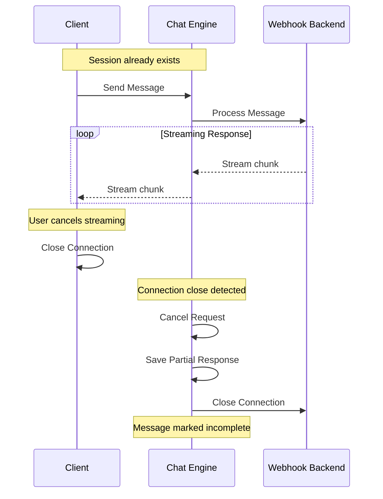
```mermaid
sequenceDiagram
    participant Client
    participant Chat Engine
    participant Webhook Backend

    Note over Client,Chat Engine: Session already exists

    Client->>Chat Engine: Send Message
    Chat Engine->>Webhook Backend: Process Message

    loop Streaming Response
        Webhook Backend-->>Chat Engine: Stream chunk
        Chat Engine-->>Client: Stream chunk
    end

    Note over Client: User cancels streaming
    Client->>Client: Close Connection

    Note over Chat Engine: Connection close detected
    Chat Engine->>Chat Engine: Cancel Request
    Chat Engine->>Chat Engine: Save Partial Response
    Chat Engine->>Webhook Backend: Close Connection

    Note over Chat Engine: Message marked incomplete
```

#### S11: Search Session History

**ID**: `cpt-chat-engine-seq-search-session`
**Use Case**: `cpt-chat-engine-fr-search-session`
**Actors**: `cpt-chat-engine-actor-client`

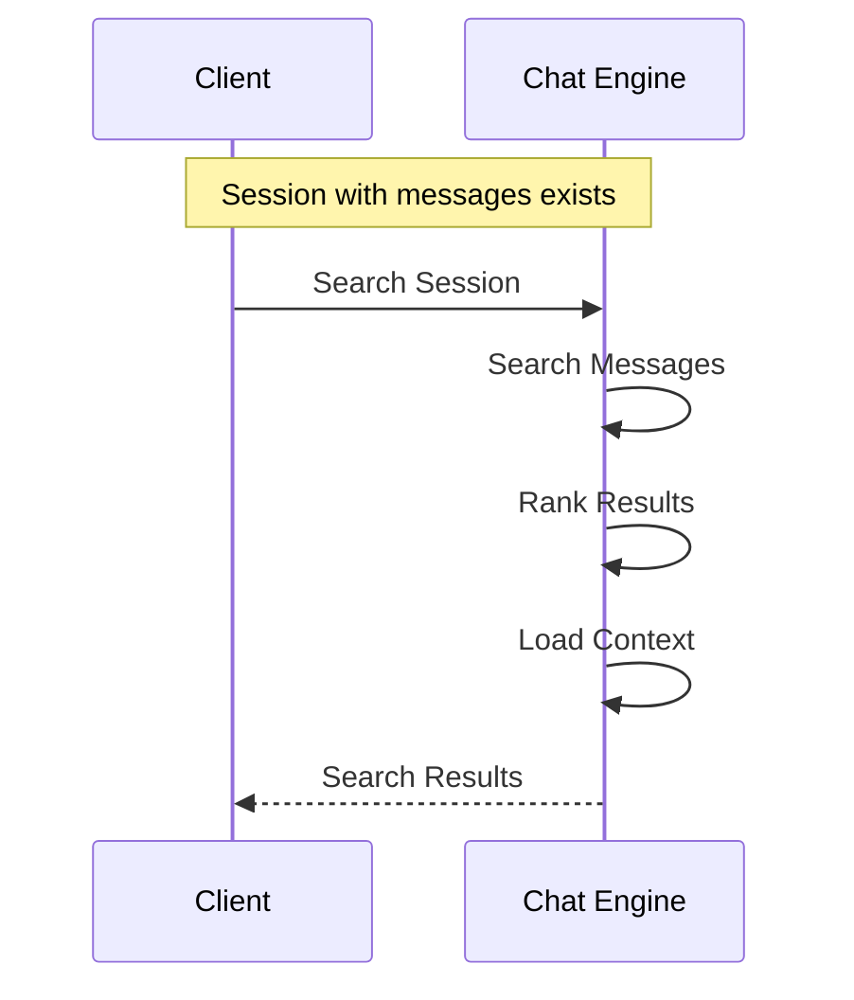
```mermaid
sequenceDiagram
    participant Client
    participant Chat Engine

    Note over Client,Chat Engine: Session with messages exists

    Client->>Chat Engine: Search Session
    Chat Engine->>Chat Engine: Search Messages
    Chat Engine->>Chat Engine: Rank Results
    Chat Engine->>Chat Engine: Load Context
    Chat Engine-->>Client: Search Results
```

#### S12: Search Across Sessions

**ID**: `cpt-chat-engine-seq-search-sessions`
**Use Case**: `cpt-chat-engine-fr-search-sessions`
**Actors**: `cpt-chat-engine-actor-client`

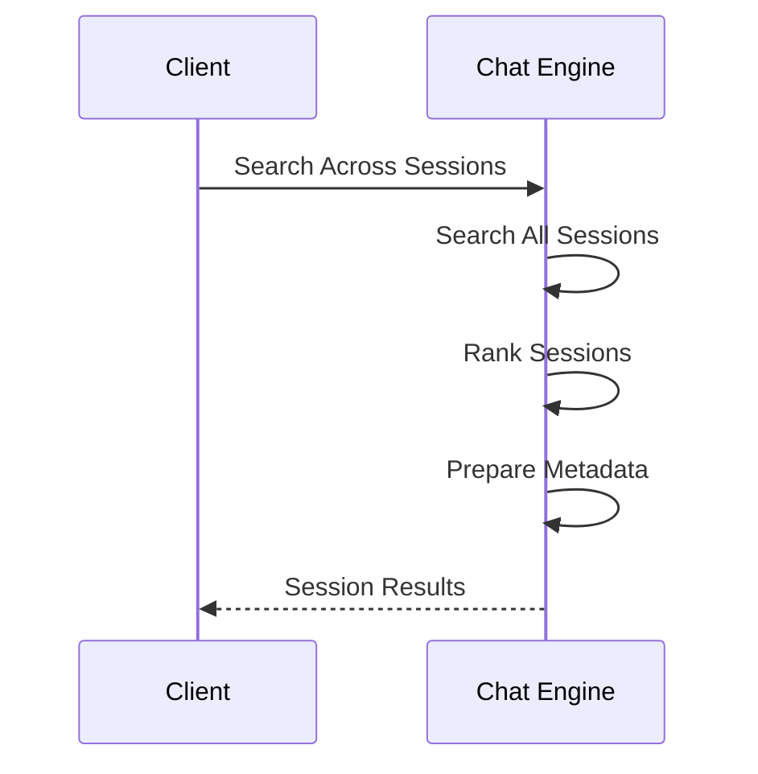
```mermaid
sequenceDiagram
    participant Client
    participant Chat Engine

    Client->>Chat Engine: Search Across Sessions
    Chat Engine->>Chat Engine: Search All Sessions
    Chat Engine->>Chat Engine: Rank Sessions
    Chat Engine->>Chat Engine: Prepare Metadata
    Chat Engine-->>Client: Session Results
```

#### S13: Generate Session Summary

**ID**: `cpt-chat-engine-seq-generate-summary`
**Use Case**: `cpt-chat-engine-fr-session-summary`
**Actors**: `cpt-chat-engine-actor-client`, `cpt-chat-engine-actor-webhook-backend`

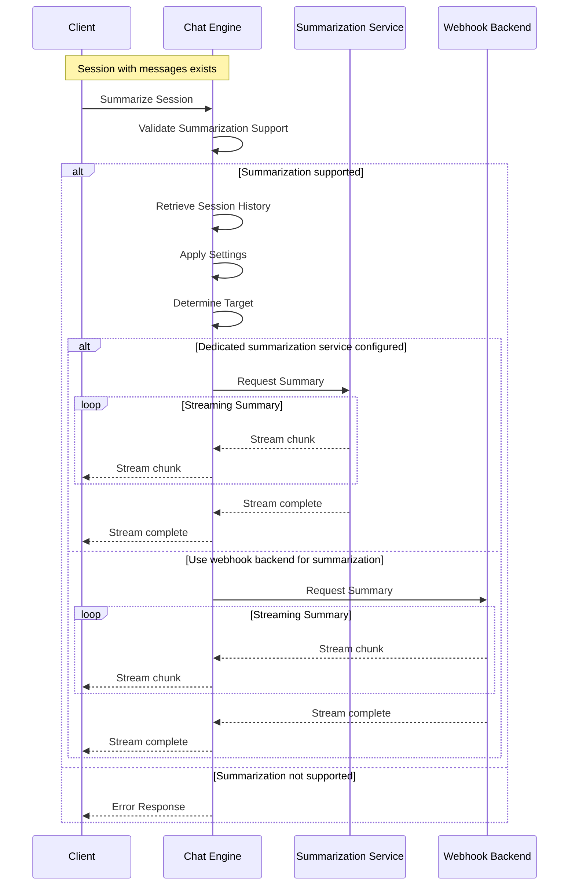
```mermaid
sequenceDiagram
    participant Client
    participant Chat Engine
    participant Summarization Service
    participant Webhook Backend

    Note over Client,Chat Engine: Session with messages exists

    Client->>Chat Engine: Summarize Session
    Chat Engine->>Chat Engine: Validate Summarization Support

    alt Summarization supported
        Chat Engine->>Chat Engine: Retrieve Session History
        Chat Engine->>Chat Engine: Apply Settings
        Chat Engine->>Chat Engine: Determine Target

        alt Dedicated summarization service configured
            Chat Engine->>Summarization Service: Request Summary

            loop Streaming Summary
                Summarization Service-->>Chat Engine: Stream chunk
                Chat Engine-->>Client: Stream chunk
            end

            Summarization Service-->>Chat Engine: Stream complete
            Chat Engine-->>Client: Stream complete
        else Use webhook backend for summarization
            Chat Engine->>Webhook Backend: Request Summary

            loop Streaming Summary
                Webhook Backend-->>Chat Engine: Stream chunk
                Chat Engine-->>Client: Stream chunk
            end

            Webhook Backend-->>Chat Engine: Stream complete
            Chat Engine-->>Client: Stream complete
        end
    else Summarization not supported
        Chat Engine-->>Client: Error Response
    end
```

#### S14: Add Message Reaction (HTTP)

**ID**: `cpt-chat-engine-seq-add-reaction`
**Use Case**: `cpt-chat-engine-fr-message-feedback`
**Actors**: `cpt-chat-engine-actor-client`, `cpt-chat-engine-actor-webhook-backend`

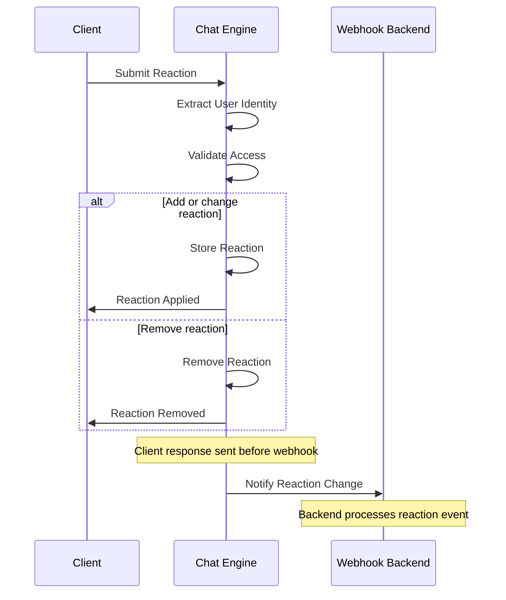
```mermaid
sequenceDiagram
    participant C as Client
    participant CE as Chat Engine
    participant WH as Webhook Backend

    C->>CE: Submit Reaction
    CE->>CE: Extract User Identity
    CE->>CE: Validate Access

    alt Add or change reaction
        CE->>CE: Store Reaction
        CE->>C: Reaction Applied
    else Remove reaction
        CE->>CE: Remove Reaction
        CE->>C: Reaction Removed
    end

    Note over CE: Client response sent before webhook

    CE->>WH: Notify Reaction Change
    Note over WH: Backend processes reaction event
```

**Flow**:
1. Client submits reaction with reaction_type
2. Chat Engine validates JWT and message access
3. Database stores or removes reaction based on type
4. Client receives immediate confirmation
5. Webhook notification sent asynchronously (fire-and-forget)

#### S15: Remove Message with Reactions (Cascade Delete)

**ID**: `cpt-chat-engine-seq-delete-message-cascade`
**Use Case**: Message deletion with reaction cleanup
**Actors**: `cpt-chat-engine-actor-client`

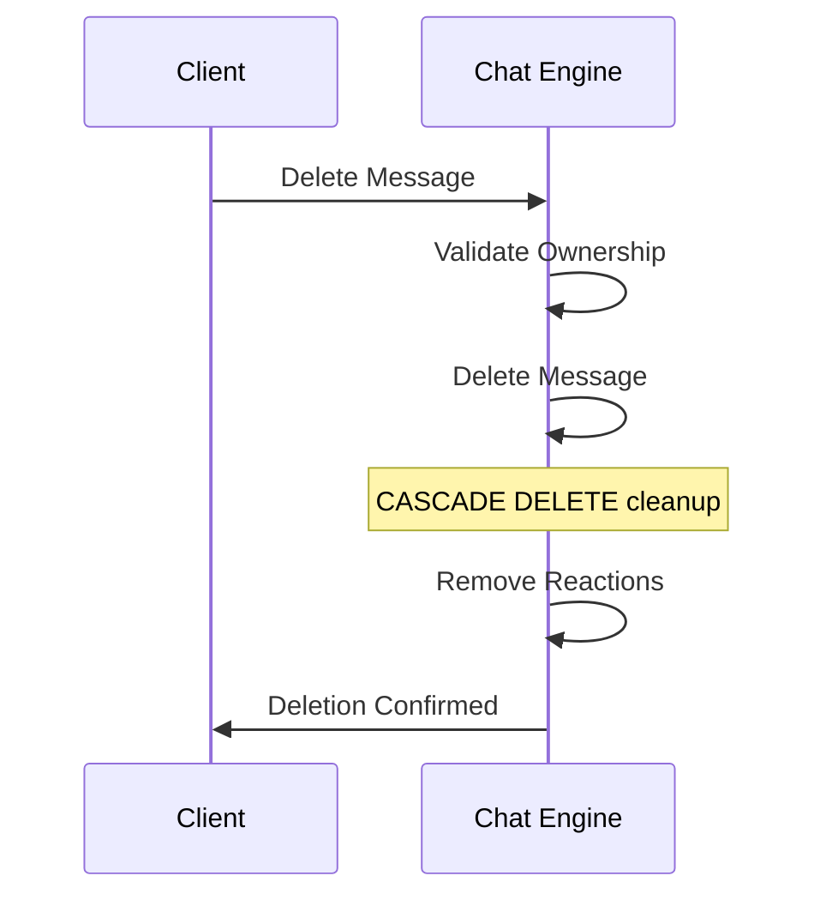
```mermaid
sequenceDiagram
    participant C as Client
    participant CE as Chat Engine

    C->>CE: Delete Message
    CE->>CE: Validate Ownership
    CE->>CE: Delete Message

    Note over CE: CASCADE DELETE cleanup

    CE->>CE: Remove Reactions
    CE->>C: Deletion Confirmed
```

**Flow**:
1. Client requests message deletion
2. Database CASCADE DELETE automatically removes all reactions
3. No orphaned reactions remain in database

### Database schemas & tables

**Schema location**: `migrations/` (versioned migration files)

#### Table: sessions

**ID**: `cpt-chat-engine-dbtable-sessions`

| Column | Type | Description |
|--------|------|-------------|
| session_id | UUID PK | Unique session identifier |
| client_id | VARCHAR | Owning client identifier (from JWT) |
| session_type_id | UUID FK | References session_types |
| available_capabilities | JSONB | Capabilities returned by webhook at session creation |
| metadata | JSONB | Client-defined session metadata |
| lifecycle_state | VARCHAR | `active` / `archived` / `soft_deleted` / `hard_deleted` |
| share_token | VARCHAR UNIQUE NULL | Generated share token for session sharing |
| created_at | TIMESTAMPTZ | Creation timestamp |
| updated_at | TIMESTAMPTZ | Last modification timestamp |

#### Table: messages

**ID**: `cpt-chat-engine-dbtable-messages`

| Column | Type | Description |
|--------|------|-------------|
| message_id | UUID PK | Unique message identifier |
| session_id | UUID FK | References sessions |
| parent_message_id | UUID FK NULL | Parent in message tree (NULL for root) |
| role | VARCHAR | `user` / `assistant` / `system` |
| content | JSONB | Array of ContentPart objects |
| file_ids | UUID[] | File UUID references |
| variant_index | INT | Variant position among siblings |
| is_active | BOOL | Whether this is the active variant in the tree |
| is_complete | BOOL | Whether streaming completed (false = partial/aborted) |
| is_hidden_from_user | BOOL | Excluded from client-facing APIs |
| is_hidden_from_llm | BOOL | Excluded from webhook context |
| metadata | JSONB | Backend-supplied message metadata |
| created_at | TIMESTAMPTZ | Creation timestamp |

**Constraints**: UNIQUE (session_id, parent_message_id, variant_index)

#### Table: message_reactions

**ID**: `cpt-chat-engine-dbtable-reactions`

| Column | Type | Description |
|--------|------|-------------|
| message_id | UUID FK | References messages (CASCADE DELETE) |
| user_id | VARCHAR | Reacting user identifier |
| reaction_type | VARCHAR | `like` / `dislike` / `none` |
| created_at | TIMESTAMPTZ | First reaction timestamp |
| updated_at | TIMESTAMPTZ | Last update timestamp |

**PK**: (message_id, user_id)

#### Table: session_types

**ID**: `cpt-chat-engine-dbtable-session-types`

| Column | Type | Description |
|--------|------|-------------|
| session_type_id | UUID PK | Unique session type identifier |
| name | VARCHAR | Human-readable name |
| webhook_url | VARCHAR | Webhook backend HTTP endpoint (HTTPS required in production) |
| timeout_ms | INT | Request timeout in milliseconds |
| summarization_settings | JSONB NULL | Optional summarization configuration |
| meta | JSONB | Additional configuration metadata |
| created_at | TIMESTAMPTZ | Creation timestamp |
| updated_at | TIMESTAMPTZ | Last modification timestamp |

### 3.5 Authorization Model

**ID**: `cpt-chat-engine-design-auth-model`

#### Authentication

All client requests require a valid JWT Bearer token in the `Authorization` header. Chat Engine validates JWT signature and expiration, and extracts the `client_id` claim to establish request identity.

#### Authorization Rules

| Resource | Operation | Requirement | Validation |
|----------|-----------|-------------|------------|
| Session | Create | JWT valid | `client_id` from JWT becomes session owner |
| Session | Read / Delete | JWT + ownership | `client_id` must match session `client_id` |
| Message | Send | JWT + session ownership | Session must belong to `client_id` |
| Message | Delete | JWT + ownership | Only message author can delete |
| Message | React | JWT + session access | Session must be accessible to `client_id` |
| Shared session | Read | Share token | Valid non-expired share token required |
| Session type | Configure | Admin role | Elevated admin claim in JWT |

#### Inter-Service Authentication

Chat Engine does not add authentication headers to webhook requests. Webhook endpoint security (API keys, mTLS) is the responsibility of the session type administrator. Webhook URLs must use HTTPS in production environments.

### 3.6 Data Protection

**ID**: `cpt-chat-engine-design-data-protection`

#### Personal Data Classification

| Data Type | Classification | Storage Location | Retention |
|-----------|---------------|-----------------|-----------|
| `client_id` | Pseudonymous identifier | Sessions, Messages | Session lifecycle |
| Message content | Potentially personal | Messages table | FR-020 retention policy |
| Session metadata | Potentially personal | Sessions table | Session lifecycle |
| File UUIDs | Reference only (not content) | Messages table | Session lifecycle |
| Reaction `user_id` | Pseudonymous identifier | Reactions table | Message lifecycle |
| Share tokens | Non-personal | Sessions table | Session lifecycle |

#### Data Erasure

- **Soft delete**: Marks session as `soft_deleted`; data preserved for recovery window
- **Hard delete**: Permanently removes session, messages, reactions, and metadata
- **Individual message deletion**: `cpt-chat-engine-fr-delete-message` enables targeted erasure
- **Automated cleanup**: `cpt-chat-engine-fr-message-retention` for age-based or count-based cleanup

#### Data in Transit

All external communication requires TLS: Client ↔ Chat Engine (HTTPS), Chat Engine ↔ Webhook (HTTPS in production), Chat Engine ↔ Database (encrypted connection).

#### Data at Rest

Database-level encryption is an infrastructure concern configured at the database cluster level. Application-level field encryption is excluded (see Section 5: Intentional Exclusions).

### 3.7 Observability

**ID**: `cpt-chat-engine-design-observability`

#### Structured Logging

All request handling emits structured log events with the following fields: `trace_id`, `client_id`, `session_id`, `operation`, `duration_ms`, `status`. Message content and personal data are never logged.

#### Metrics

| Metric | Type | Description |
|--------|------|-------------|
| `request_duration_seconds` | Histogram | HTTP latency by endpoint and status code |
| `webhook_duration_seconds` | Histogram | Webhook backend call latency by session_type_id |
| `circuit_breaker_state` | Gauge | Circuit state per session_type_id (closed/open/half-open) |
| `active_streams` | Gauge | Concurrent streaming connections |
| `session_operations_total` | Counter | Session operations by type and result |

#### Health Endpoints

- `GET /health/live` — liveness probe (returns 200 if process is running)
- `GET /health/ready` — readiness probe (includes database connectivity check)

#### Distributed Tracing

`trace_id` is generated per request and propagated in all outbound calls (webhook, database). Included in error responses for support correlation without exposing internal details.

### 3.8 Testing Architecture

**ID**: `cpt-chat-engine-design-testing-arch`

| Layer | Scope | Approach |
|-------|-------|----------|
| Unit | Domain logic, message tree operations, validation rules | Pure function tests, no I/O |
| Integration | Database operations, webhook client | Real test database, mock webhook server |
| API | HTTP endpoints, streaming, auth | Test HTTP server, mock webhook, test database |
| Contract | Webhook API schema conformance | Schema-based tests against `webhook-protocol.json` |

Test isolation: each test case uses independent database state (transaction rollback or dedicated schema). Webhook backends are replaced by configurable mock servers. Coverage targets: 90%+ for domain layer, 100% endpoint coverage including error paths and all authorization boundaries.

## 4. Additional Context

#### Context: Message Tree Traversal

**ID**: `cpt-chat-engine-design-context-tree-traversal`

<!-- fdd-id-content -->
**ADRs**: ADR-0001 (tree structure)

Message tree traversal follows parent_message_id references. Active path is computed by following is_active = true flags from root. Full tree export requires recursive CTE queries to traverse all branches. Database indexes on parent_message_id are critical for performance.
<!-- fdd-id-content -->

#### Context: Webhook Circuit Breaker

**ID**: `cpt-chat-engine-design-context-circuit-breaker`

<!-- fdd-id-content -->
**ADRs**: ADR-0011

Circuit breaker pattern prevents cascade failures from slow/failing webhook backends. The circuit opens after reaching a configured failure threshold. Half-open state allows a single probe request to test recovery. Success closes circuit; failure reopens. Implemented per session_type_id.
<!-- fdd-id-content -->

#### Context: Streaming Backpressure

**ID**: `cpt-chat-engine-design-context-backpressure`

<!-- fdd-id-content -->
**ADRs**: ADR-0012

Streaming implementation uses bidirectional data streams with backpressure handling. If client is slow, Chat Engine buffers chunks in memory up to a configured limit. If the buffer fills, the webhook request is paused via flow control mechanisms. Client disconnect cancels the webhook request immediately.
<!-- fdd-id-content -->

#### Context: Search Performance

**ID**: `cpt-chat-engine-design-context-search`

<!-- fdd-id-content -->
**ADRs**: ADR-0023

Full-text search is implemented using database full-text search capabilities with inverted indexes on message content. Search is case-insensitive with language stemming. Results are ranked by relevance with document length normalization. Cross-session search is partitioned by client_id to prevent noisy neighbors. Pagination uses cursor-based queries for consistency.
<!-- fdd-id-content -->

#### Context: File Storage Integration

**ID**: `cpt-chat-engine-design-context-file-storage`

<!-- fdd-id-content -->
**ADRs**: ADR-0005

Chat Engine never stores file content. Clients upload directly to File Storage Service and receive stable UUID identifiers. Chat Engine stores file UUIDs (not URLs) in messages and forwards them to webhook backends. Webhook backends fetch files from File Storage Service using UUIDs. This approach provides stable identifiers, centralized access control, and enables transparent storage migration. File access is controlled through File Storage Service authentication, and clients request temporary signed URLs when displaying files.
<!-- fdd-id-content -->

#### Context: Session Type Configuration Security

**ID**: `cpt-chat-engine-design-context-security`

<!-- fdd-id-content -->
Session type webhook URLs are stored in plaintext in database. Webhook backends must implement their own authentication (API keys, mutual TLS). Chat Engine does not validate webhook responses beyond HTTP status codes. Malicious webhook backends can return arbitrary content. Session type creation should be restricted to admin users only.
<!-- fdd-id-content -->

#### Context: Error Response Security Pattern

**ID**: `cpt-chat-engine-design-context-error-security`

<!-- fdd-id-content -->
Error responses use the `ErrorDetails` schema to prevent leaking internal implementation details to clients. The schema enforces `additionalProperties: false` and defines explicit fields for each error scenario:

**Error Code to Details Mapping**:
- `INVALID_REQUEST` → validation_errors (field-level validation failures)
- `RATE_LIMIT_EXCEEDED` → retry_after_seconds, limit_type, quota_reset_at
- `BACKEND_TIMEOUT` → timeout_ms
- `SESSION_NOT_FOUND` / `MESSAGE_NOT_FOUND` → resource_id (UUID format only)
- `AUTH_REQUIRED` / `BACKEND_ERROR` / `INTERNAL_ERROR` → trace_id only (for support correlation)

**Security Constraints**:
- No arbitrary data allowed in error details (prevents stack trace leaks)
- trace_id limited to alphanumeric characters (no file paths or SQL fragments)
- resource_id validated as UUID format only
- Sensitive debugging information (stack traces, database errors, internal paths) must only appear in secure internal logs

This pattern follows RFC 9457 (Problem Details) and ensures compliance with security requirements for user-facing errors while maintaining full debugging capability through internal logging.
<!-- fdd-id-content -->

## 5. Intentional Exclusions

Aspects acknowledged and intentionally excluded from this DESIGN.

| Category | Exclusion | Reason |
|----------|-----------|--------|
| **Content Safety** | Content moderation, toxicity filtering | Delegated to webhook backends (Principle: Zero Business Logic in Routing — `cpt-chat-engine-principle-zero-business-logic`) |
| **Accessibility** | UI/UX accessibility requirements | Backend service; client application responsibility |
| **Internationalization** | Multi-language UI, locale handling | Not applicable; message content is opaque to Chat Engine |
| **Rate Limiting** | Throttling algorithms, quota management | Handled at API gateway layer upstream of Chat Engine |
| **Application Caching** | In-process or distributed cache | Excluded per `cpt-chat-engine-constraint-single-database` |
| **Message Encryption** | Application-level field encryption | Infrastructure-level database encryption handles data-at-rest |
| **Async Queue** | Message queue / event bus integration | Excluded per `cpt-chat-engine-constraint-sync-webhooks` |
| **Deployment** | Container orchestration, cloud-specific config | Infrastructure concern; out of DESIGN scope |
| **Client SDKs** | SDK implementation details | Covered by developer experience NFR; not a design deliverable |
